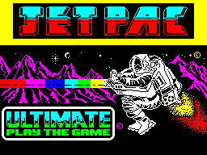
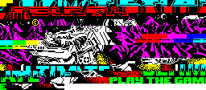

# smstilemap - a Sega Master System tile library

Most tools for creating background tiles and sprites for the Sega Master System
(SMS) are only available on the Windows operating system, making it challenging
for macOS and Linux users.

This small Go language library was created to aid developers converting raster
images (e.g. PNG) to the SMS tile, palette, and tilemap (name table) data.

The source image is converted into 8x8 pixel tiles, duplicate tiles are removed
(using both vertical and horizontal flipping comparison). SMS colour palette
data is generated from the image, and a tilemap is generated.

Note: if the colours in the source image do not match exactly those on the SMS,
a nearest match conversion will be attempted. This can have an undesirable
effect, so it's recommend to follow the image generation guide below.


## Usage

```
Usage of smstilemap:
  -in string
    	Input PNG filename
  -out string
    	Output directory for generated files (default: input filename directory)
  -fmt string
    	Output format: asm, tiles (default "asm")
  -v	Display version number
```

To convert an image to Sega Master System assembly code:

    $ smstilemap -in=/path/to/image.png

This will generate a Z80 assembly source code file (`.asm`) comprising of the SMS tile,
tilemap, and palette data, in the same directory as the image: `/path/to/image.asm`.

To specify a different output directory, use the `-out` flag. For example:

    $ smstilemap -in=/path/to/image.png -out=/output/dir

which will write the data as: `/output/dir/image.asm`.

Along with ASM code, it's also possible to output a PNG image containing all
the unique tiles from the source image (tile data), by using the `-fmt=tiles`
CLI option.

    $ smstilemap -in=/path/to/image.png -fmt=tiles

The 1983 ZX Spectrum JETPAC game loading screen (without colour clash!):



As a set of unique tiles:




## Guide to generating Sega Master System compatible images

Any graphics or sprite editor that can control the colour palette and export to
PNG can be used.

Master System specs:

* 256x192 pixels screen size (viewport)
* 64 predefined colours
* 32 palette colours: 16 for background tiles and 16 for sprites or background tiles
* tile size: 8x8 pixels
* maximum of 448 unique tiles

When creating the source image, the above dimensions, colours, and palette size
should be used. See [sms/colour.go] for a list of the RGB colours the SMS
supports.

The Master System screen viewport would require 768 unique tiles to fill it.
As the SMS can only hold a maximum of 448 tiles, images need to be crafted for
tile re-use. Careful alignment along 8 pixel boundaries and utilising flipped
tiles (vertical and horizontal) can help to achieve this maximum tile usage.


## LICENSE

Copyright (c) 2021 Michael R. Cook. All rights reserved.

This work is licensed under the terms of the MIT license.
For a copy, see <https://opensource.org/licenses/MIT>.

Various snippets of information from the [SMS Power](https://www.smspower.org)
website have been reproduced in the source code comments.
